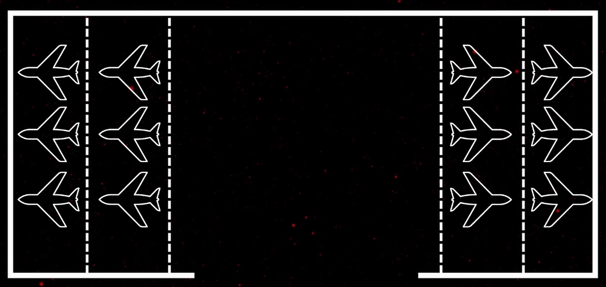

# Airport Capacity and Ground Space Management 

## Description

A full stack web application developed for NetJets to provide real-time and projected capacities at airports. This application can provide recommendations, such as where to move aircraft in order to provide space for incoming flights, as well as simulate projected parking scenarios for planned flights for estimating the capacity at specific FBOs. Airport and FBO data can be added manually by batch file. FBOs can also be drawn by the user in addition to the batch file upload.


## Tech Stack 

**Front End**

* React.js
* Google Maps API
* JavaScript
* HTML
* CSS

**Back End**
* Node.js
* JavaScript

**Database**
* MySQL

**DevOps and Infra**
* AWS Amplify
* Docker
* GitLab

## Getting started

1. Install Dependencies 

```
cd client
npm install
```

```
cd server
npm install
```

2. Running Project
```
cd client
npm start
```

```
cd server
node index.js
```

## Okta Login
Currently, okta is set up with a sample dev account. It will need to be integrated with the internal Okta system for NetJets. All account creation, editing, and deletion is done through Okta. Okta is implemented using the Okta-hosted Sign-in Widget to redirect the users to authenticate, then redirect back to the app. This is the recommended approach by Okta.

**Sample User:**

Username: 
```
test@dev.com
```
Password:
```
NetJetsSampleAccount
```

## Recommendation Engine and Simulator Constraints
- Both the Recommendation Engine and the Simulator assume that planes are parked in a non-stacked format with padding between them. It does not account for other ways of organizing planes within an FBO


- A current work around is to create different parking areas of the rows of aircraft with the "Edit FBO" feature on the Summary Page

- Feeder airports have not been implemented due to that not being the current mode of operations for NetJets, but it can be added at a later date once that occupational model is implemented. 


## SWIM Data
- Reference README in flight-data-scraping


## Authors and acknowledgment
- MSU Capstone Team: Ryan MacDonald, Kendall Korcek, Jay Scott, Emily Telgenhoff, Ben Grycza, Ryann Seymour
- A special thanks to: Kyle Sims, Amadou Anne, Morgan Schall, Lee Hoxworth