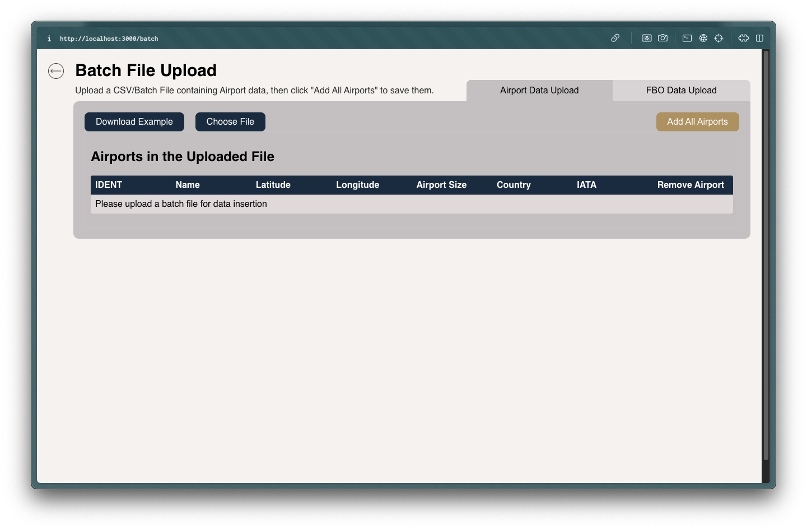

# Airport Capacity and Ground Space Management 

## Description

A full stack web application developed for NetJets to provide real-time and projected capacities at airports. This application can provide recommendations, such as where to move aircraft in order to provide space for incoming flights, as well as simulate projected parking scenarios for planned flights for estimating the capacity at specific FBOs. Airport and FBO data can be added manually by batch file. FBOs can also be drawn by the user in addition to the batch file upload.


## Tech Stack 

**Front End**

* React.js
* Google Maps API
* JavaScript
* HTML
* CSS

**Back End**
* Node.js
* JavaScript

**Database**
* MySQL

**DevOps and Infra**
* AWS Amplify
* Docker
* GitLab


## Getting started

1. Install Dependencies 

```
cd client
npm install
```

```
cd server
npm install
```

2. Running Project:

    In one terminal session:

```
cd airport-capacity-management/client
npm start
```

&nbsp;&nbsp;&nbsp;&nbsp;&nbsp;&nbsp;&nbsp;&nbsp;&nbsp;&nbsp;&nbsp;&nbsp;In a separate terminal session:

```
cd airport-capacity-management/server
node index.js
```

&nbsp;&nbsp;&nbsp;&nbsp;&nbsp;&nbsp;&nbsp;&nbsp;&nbsp;&nbsp;&nbsp;&nbsp;The AWS RDS database is not publically accesssible, it must be accessed via a ssh tunnel through an AWS EC2 bastion server, so set that up in a third terminal session:

```
ssh -i {local path to ec2 .pem key file} -L 50173:{RDS database endpoint}:3306 {EC2 endpoint}
```


## Okta Login
Currently, okta is set up with a sample dev account. It will need to be integrated with the internal Okta system for NetJets. All account creation, editing, and deletion is done through Okta. Okta is implemented using the Okta-hosted Sign-in Widget to redirect the users to authenticate, then redirect back to the app. This is the recommended approach by Okta.

**Sample User:**

Username: 
```
test@dev.com
```
Password:
```
NetJetsSampleAccount
```


## Main Map Page

The map page serves as a landing page for the user, as well as provides an overview on the statuses of airports all across the United States. Here, users can easily navigate to their desired airport through either the search function in the top right corner, or by clicking on the airport's icon. 

The notification center is accessed through the icon in the top right corner. Here, notifications are displayed for any airport who's status may be a concern for overcapacity scenarios. 

Airport icons are displayed two ways. When they do not yet have FBOs set up, they display as the navy dot. When FBO data is added for an airport, it will display as the downward facing arrow, which changes color based on the capacity of the airport. Above the arrow, the current capacity is displayed through a fill bar for quick reference. To see the actual percentage, a user can look for the airport in the menu in the top left corner.  

To access the Summary Page, click on either the icon associated with the desired airport, or click on the name of the airport in the dropdown menu. 

To access the Batch File Upload page, click on the "Add Data" button. 


## Summary Page
The summary page gives the user a closer look into a specific airport. At the top, there is a percentage that represents the status of the capacity filled of the entire airport. To the right, the page displays a satellite photo of the airport selected with the FBOs labeled and outlined in the color associated with their current capacity. 

The Traffic Overview gives a hourly look into the projected and historical population of the airport. It displays the count of planes that are arriving, departing, or parked. A legend is provided for ease of use. 

The Arriving Flights and Departing Flights table allow the user to see any incoming or departing flights in the upcoming hours from the currently selected airport. It gives information like the plane footprint and size to assist in planning. 

The FBOs table shows the user the FBOs at the current airport. Their current capacity status is shown with a percentage, and the color correlates with the outline of the FBO shown on the map. The priority shown determines the order in which they will be filled, and can be edited by selecting the "Edit FBO" button. 

The Open Parking by Aircraft Type table tells the user how many of each type of aircraft can fit in the remaining space of the selected FBO once a user selects one by clicking the "Select FBO" button.

The Recommendation page can be accessed by clicking the "See more" button at the bottom of the page. 


## Edit FBO page

The Edit FBO page allows a user to either create a new FBO or edit an existing FBO. Once a user draws out the outline of the new FBO, the system automatically calculates the amount of planes that can fit in the area. The user can then either increase or decrease the plane footprint to make a more accurate capacity calculation, depending on what the parking area will be used for. 


## Batch File Upload Page
The Batch File Upload page allows a user to upload a batch file of either airport data or specific FBO data. 

A user can download an example CSV file to get an idea of the required structure by clicking the "Download Example" button. 
To upload a created file, a user can click the "Choose File" button and select the desired file from their computer. 


A user can select the "Airport Data Upload" tab, upload a CSV file with the correct information about the new airport, and the application will create a new airport to be used to track capacity. An example situation where this feature may be useful is when an owner wants to create their own temporary airport. 


When a user clicks the "FBO Data Upload" tab, they can upload relevant information about the FBO that they want to add to the system. Although FBOs can be added on the summary page, this feature can be used to populate multiple FBOs rapidly with just a CSV file. 


## Flight Simulator Page


The Flight Simulator Page gives the user a more in depth look at a specific airport. To the left, there is a "All FBOs" table, which displays the planes in all of the FBOs at the airport. The colors next to each plane represent their current status (arriving, departing, parked, or maintenance). In the top right corner, a user can filter this table by FBO, plane size, plane type, or search for specific tail numbers.

## Operational Recommendations Tab (on Flight Simulator page)


On the right of the simulator page, there is the Operational Recommendations. When a user selects an FBO from the top dropdown box, this provides recommendations on where to move planes that are in the FBO. The recommendations are made by searching for room in lower priority FBOs in order to conserve space in higher priority FBOs for incoming planes. If no remaining FBOs have space to accommodate the selected plane, the recommendation engine will show the closest airport that can accommodate the plane. 

A user can sort the airplanes by time grounded and plane size, as well as view the recommendation for the plane by clicking on the plane's row. 


## Simulation Tab (on Flight Simulator page)

The Simulation Tab helps the user plan where to park future incoming planes. To do this, the user can select as many tail numbers as they wish from the menu, and then set the desired arrival time. The simulation engine will then look at a snapshot of the projected airport capacity at that time, and if there is space projected at that time, place the airplane at the highest priority FBO. If there is no space at that FBO, it will cycle through all of the FBOs at the airport until a space is found. If all of the FBOs are full, then the simulation will notify the user if that. 


## Recommendation Engine and Simulator Constraints
Both the Recommendation Engine and the Simulator assume that planes are parked in a non-stacked format with padding between them. It does not account for other ways of organizing planes within an FBO


A current work around is to create different parking areas of the rows of aircraft with the "Edit FBO" feature on the Summary Page

Feeder airports have not been implemented due to that not being the current mode of operations for NetJets, but it can be added at a later date once that occupational model is implemented. 


## SWIM Data
- Reference README in flight-data-scraping


## Authors and acknowledgment
- MSU Capstone Team: Ryan MacDonald, Kendall Korcek, Jay Scott, Emily Telgenhoff, Ben Grycza, Ryann Seymour
- A special thanks to: Kyle Sims, Amadou Anne, Morgan Schall, Lee Hoxworth